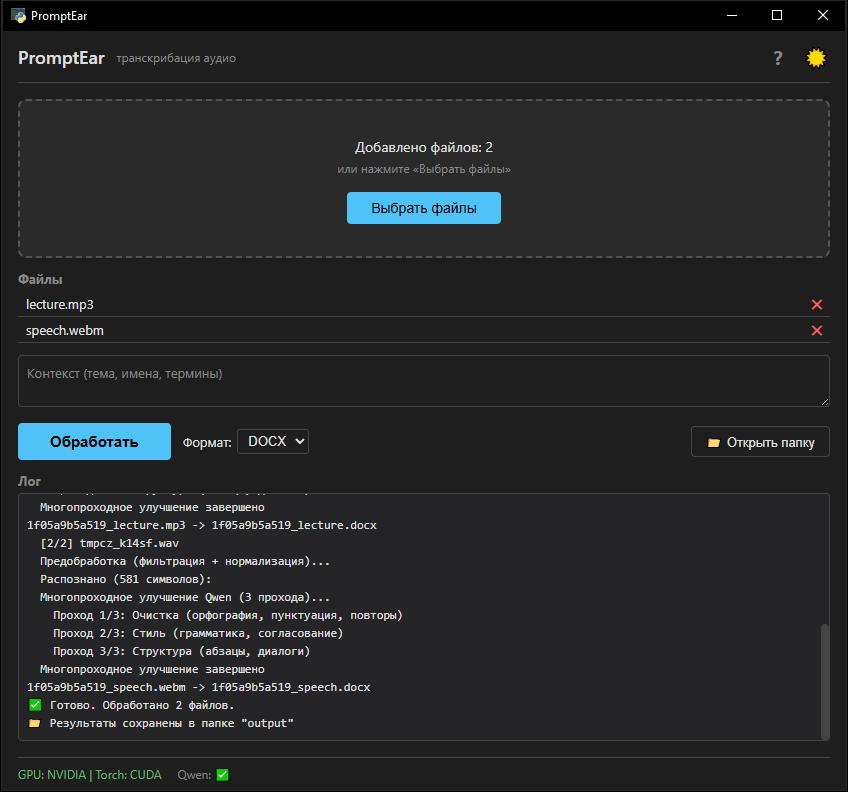

# PromptEar


> Устали вручную расшифровывать интервью или переслушивать лекции?  
> PromptEar делает это за вас — полностью локально, за пару кликов.
>
> **Скачать:** [CPU (GitHub Releases)](https://github.com/radiohd-rf/PromptEar/releases/latest) · [GPU (Яндекс.Диск)](https://disk.yandex.ru/d/7YLfrrD35gmoxQ)

## Демонстрация



## Для кого

- **Журналисты / блогеры** — вместо часов расшифровки — несколько минут
- **Студенты** — лекции превращаются в структурированные конспекты
- **Разработчики** — стенограммы созвонов и митапов
- **Все** — забудьте о печати с голоса

## Возможности

- Drag-and-drop аудио (MP3, WAV, FLAC, OGG, M4A, AAC, WMA) и **видео** (MP4, AVI, MKV, MOV, WEBM, WMV)
- Автоматическое извлечение аудиодорожки из видео (встроенный ffmpeg)
- Распознавание речи через **faster-whisper** (CPU или CUDA)
- 3-проходное улучшение текста через **Qwen 2.5** (Ollama): очистка → грамматика/стиль → структура абзацев
- Автоопределение темы разговора
- Сохранение в **TXT** или **DOCX**
- Компрессия тихих записей (ffmpeg)
- Тёмная/светлая тема интерфейса
- Остановка обработки в любой момент

## Быстрый старт (CPU)

1. Скачать `PromptEar-v0.11.2-cpu.zip` со страницы [релизов](https://github.com/radiohd-rf/PromptEar/releases)
2. Распаковать в любую папку
3. Запустить `Запустить PromptEar.exe`
4. Дождаться установки (bootstrap — 1 раз, скачает модели ~1.5 GB)
5. Перетащить аудиофайлы в окно → нажать «Обработать»

Требуется: **Ollama** с моделью `qwen2.5:3b` (устанавливается автоматически при первом запуске).

## GPU версия (CUDA)

Для видеокарт NVIDIA:

- **Скачать:** [Яндекс.Диск](https://disk.yandex.ru/d/7YLfrrD35gmoxQ) — пароль: `PromptEar`
- Всё остальное так же, как в CPU версии

Размер: ~2.5 GB (torch с CUDA 12.6).  
Ускорение: в 3-5x быстрее CPU.

## Архитектура

```
Запустить PromptEar.exe (C# лаунчер)
  └─ bootstrap.bat (однократная установка)
      └─ python main.py
           └─ PyWebView (нативное окно)
                └─ веб-интерфейс (Flask + SSE)
                     ├─ Drag-and-drop файлов
                     ├─ Whisper → распознавание
                     ├─ Ollama (Qwen 2.5) → 3-pass улучшение
                     └─ TXT/DOCX → сохранение
```

### Ключевые модули

| Модуль | Назначение |
|--------|-----------|
| `main.py` | PyWebView — нативное окно браузера |
| `web/server.py` | Flask + SSE события (лог, прогресс, статус) |
| `web/index.html` | Интерфейс drag-and-drop |
| `config.py` | Единый конфиг: пути, модель, таймауты |
| `processing/transcriber.py` | Whisper + прогресс-коллбек |
| `processing/enhancer.py` | Ollama: 1-pass и 3-pass (очистка→стиль→структура) |
| `core/detector.py` | Анализ громкости, препроцессинг ffmpeg |
| `build_zips.py` | Сборка zip-дистрибутива (pip download wheels) |

## Технологии

| Компонент | Технология |
|-----------|-----------|
| Окно | PyWebView (Microsoft Edge WebView2) |
| Сервер | Flask + Server-Sent Events |
| Распознавание | faster-whisper (CTranslate2) |
| Улучшение текста | Ollama + Qwen 2.5 3b |
| Лаунчер | C# (.NET Framework) |
| Сборка | build_zips.py + pip download |

## Сборка из исходников

```bash
# CPU
python build_zips.py cpu

# CUDA
python build_zips.py cu126
```

Требуется Python 3.12. На выходе — готовый zip с wheel-файлами torch.

## Лицензия

MIT
