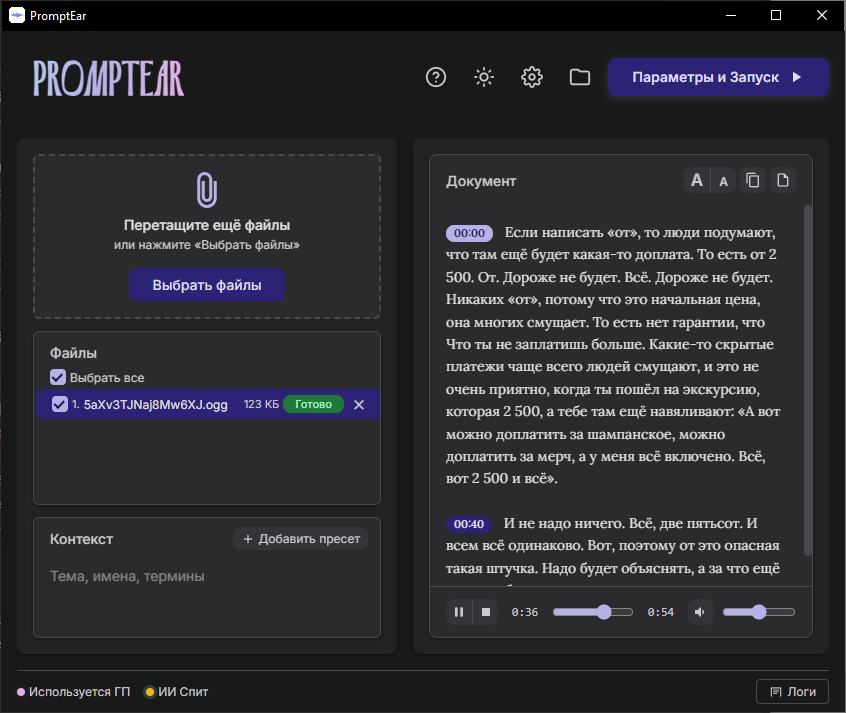

# PromptEar


> Устали вручную расшифровывать интервью или переслушивать лекции?
> PromptEar делает это за вас — полностью локально, за пару кликов.
>
> **Скачать:** [Последний релиз (GitHub Releases)](https://github.com/radiohd-rf/PromptEar/releases/latest)

## Демонстрация



## Для кого

- **Журналисты / блогеры** — вместо часов расшифровки — несколько минут
- **Студенты** — лекции превращаются в структурированные конспекты
- **Разработчики** — стенограммы созвонов и митапов
- **Все** — забудьте о печати с голоса

## Возможности

- Drag-and-drop аудио (MP3, WAV, FLAC, OGG, M4A, AAC, WMA) и **видео** (MP4, AVI, MKV, MOV, WEBM, WMV)
- Автоматическое извлечение аудиодорожки из видео (встроенный ffmpeg)
- Батч-обработка нескольких файлов — каждый файл отдельная задача с выборочным отчётом
- Распознавание речи: **Whisper** (faster-whisper, CPU или CUDA) или **GigaAM v3** (лучшая точность для русского)
- 3-проходное улучшение текста через **llama.cpp** (встроенный llama-server + модель Gemma): очистка → грамматика/стиль → структура абзацев
- **Окно «Контекст»** с пресетами шаблонов по теме (интервью, лекция, заседание, созвон)
- Улучшение текста с ИИ: чекбокс **«Обработать с ИИ»** при запуске — текст сразу после распознавания перерабатывается в 3 прохода (очистка → грамматика/стиль → структура абзацев) с живой трансляцией результата в окне «Документ»
- **Окно «Документ»** с результатом: тайм-коды `[MM:SS]`, регулировка размера текста, копирование, открытие готового файла в редакторе
- **Аудиоплеер стенограммы**: плэй/пауза/стоп, таймлайн с перемоткой, громкость; клик по абзацу — воспроизведение с этого места с подсветкой и автопрокруткой
- Перевод результата на любой язык (Gemma)
- Автоопределение темы разговора
- Сохранение в **TXT**, **MD**, **DOCX**, **SRT** или **VTT**
- Компрессия тихих записей (ffmpeg)
- Тёмная/светлая тема интерфейса
- Остановка обработки в любой момент

## Быстрый старт

1. Скачать `PromptEar-v0.17.0.zip` со страницы [релизов](https://github.com/radiohd-rf/PromptEar/releases)
2. Распаковать в любую папку
3. Запустить `Запустить PromptEar.exe` (при первом входе создаётся ярлык на рабочем столе)
4. Дождаться установки (bootstrap — 1 раз)
5. Перетащить аудиофайлы в окно → выбрать параметры → «Запустить»

Требуется: Windows 10/11, ~1 ГБ свободного места + место под модели.

### Модели

- **Whisper base** — предустановлена в сборке (транскрибация работает сразу)
- **GigaAM v3** (~428 МБ) — для русского, докачивается из приложения при выборе
- **Gemma (GGUF, ~3 ГБ)** — для ИИ-улучшения и перевода, докачивается при первом включении ИИ

Все модели скачиваются и хранятся внутри папки приложения.

### GPU (NVIDIA)

Та же единая сборка. В настройках включите **«Использовать GPU»** — транскрибация и
ИИ-улучшение пойдут через видеокарту (CUDA). Без NVIDIA всё работает на CPU.

## Архитектура

```
Запустить PromptEar.exe (C# лаунчер)
  └─ bootstrap.bat (однократная установка)
      └─ python main.py
           └─ PyWebView (нативное окно)
                └─ веб-интерфейс (Flask + SSE)
                     ├─ Drag-and-drop файлов
                     ├─ Whisper / GigaAM → распознавание
                     ├─ llama.cpp → 3-проходное улучшение + перевод
                     ├─ TXT/MD/DOCX/SRT/VTT → сохранение
                     └─ аудиоплеер стенограммы (HTTP Range из кэша)
```

### Ключевые модули

| Модуль | Назначение |
|--------|-----------|
| `main.py` | PyWebView — нативное окно браузера |
| `web/server.py` | Flask + SSE события (лог, прогресс, статус), раздача аудио и файлов |
| `web/index.html`, `web/script.js` | Интерфейс drag-and-drop, окна «Контекст»/«Документ», аудиоплеер |
| `config.py` | Единый конфиг: пути, модель, таймауты |
| `core/pipeline.py` | Пайплайн одного файла: извлечение → распознавание → улучшение → сохранение |
| `core/events.py` | SSE-события и статусы задач |
| `core/asr_backends.py` | Каталог движков распознавания (Whisper / GigaAM v3) |
| `core/whisper_models.py`, `core/gigaam_models.py` | Каталоги и установка моделей |
| `core/downloader.py` | Скачивание моделей с прогрессом |
| `processing/transcriber.py` | Whisper / GigaAM + прогресс-коллбек |
| `processing/enhancer.py` | llama.cpp: 3-проходное улучшение, перевод, idle-выгрузка |
| `core/detector.py` | Анализ громкости, препроцессинг ffmpeg |
| `build_zips.py` | Сборка zip-дистрибутива (pip download wheels, лаунчер с иконкой) |

## Технологии

| Компонент | Технология |
|-----------|-----------|
| Окно | PyWebView (Microsoft Edge WebView2) |
| Сервер | Flask + Waitress + Server-Sent Events |
| Распознавание | faster-whisper (CTranslate2), GigaAM v3 |
| Улучшение текста | llama.cpp (llama-server) + Gemma GGUF |
| Лаунчер | C# (.NET Framework) |
| Сборка | build_zips.py + pip download |

## Сборка из исходников

```bash
python build_zips.py
```

Требуется Python 3.10+ и интернет. На выходе — `PromptEar-v0.17.0.zip`
с wheel-файлами зависимостей, ffmpeg, llama.cpp и моделью Whisper base.

## Лицензия

MIT